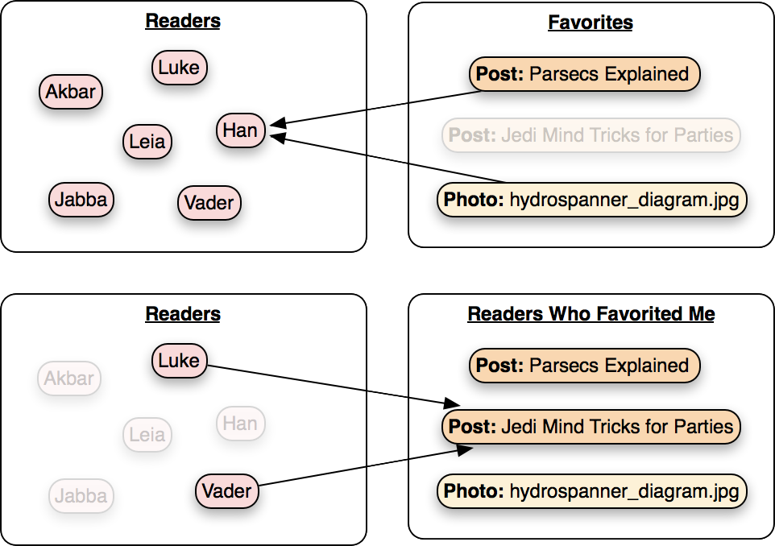
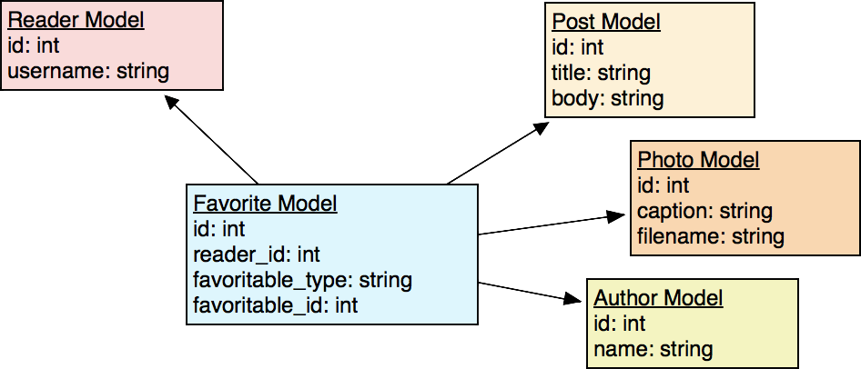

This is the last part in a three-part series of articles about polymorphic associations in Ruby on Rails, using Active Model. This part covers many-to-many polymorphic associations.

The three parts are:

1. [Introduction and how to create a basic Polymorphic Association](/polymorphic-associations-in-ruby-on-rails-part-1-introduction)
2. [Reverse Polymorphic Associations](/polymorphic-associations-in-ruby-on-rails-part-2-reverse-polymorphic-associations)
3. **Many-to-Many Polymorphic Associations**

In the previous articles we looked at basic and reverse polymorphic associations. A many-to-many polymorphic association is very similar to a reverse polymorphic association in that it will make use of an association table (join table).

On to another blog... let's give registered readers of the blog the ability to "favorite" the posts, photos and even authors they like the most.

Here's a diagram of what we want to do:



So a reader can favorite many posts, photos and authors, but also, a single post, photo or author can be favorited by many readers.

Here's a diagram of what models (and database fields) we have to make:



Let's generate the models (I'm including the models from the previous article in case you came straight to this article. But of course you wouldn't generate the same model twice in real life.)

```bash
rails g model Reader username:string
rails g model Post tile:string body:text
rails g model Photo caption:string url:string
rails g model Author name:string
```

And, the association model.

```bash
rails g model Favorite references:reader references:favoritable{polymorphic} sequence:int
```

Let's look at the models. First, the Reader model:

```ruby
class Reader < ApplicationRecord
  has_many :favorites, dependent: :destroy
end
```

Then the things that a reader can favorite:

```ruby
class Post < ApplicationRecord
  has_many :favorites, as: :favoritable, dependent: :destroy
  has_many :readers_who_favorited_me, through: :favorites
end

class Photo < ApplicationRecord
  has_many :favorites, as: :favoritable, dependent: :destroy
  has_many :readers_who_favorited_me, through: :favorites
end

class Author < ApplicationRecord
  has_many :favorites, as: :favoritable, dependent: :destroy
  has_many :readers_who_favorited_me, through: :favorites
end
```

And finally, the association table (join table):

```ruby
class Favorite
  belongs_to :reader
  belongs_to :favoritable, polymorphic: true
  default_scope { includes(:favoritable) }
end
```

The main difference between this a the reverse polymorphic association we looked at in the previous article is that the items (posts, photos, authors) all use "has\_many" associations rather than "has\_one" associations. This is what changes one-to-many into many-to-many.

The Favorite model is the model that represents the association between readers and individual items - records of its type both belong to a reader and belong to a "favoritable" item - and that's where the "polymorphic: true" comes into play.

Polymorphic associations all have have names ("commentable" from the previous article). In our example, all of the types of items can be favorited, and so they are all "favoritable".

Also, the three item types all declare:

```ruby
  has_many :readers_who_favorited_me, through: :favorites
```

Which allows us to quickly find the readers that have favorited a particular item with:

```ruby
post = Post.find(:post_id)
puts post.readers_who_favorited_me
```

(Sure, "readers_who_favorited_me" may seem like a bit... bulky, but I prefer to use bulky variable names if it makes the code easy to understand at a glance - or when coming back to it six months later.)

Also note the "dependent: destroy" declarations on some of the associations. Since we are using an association table, we want to make sure that records in that table are destroyed when a reader or an item is destroyed. If we don't do this, we'll have orphan records cluttering up the database.

Lastly, note there is a default scope on the Favorite model. Chances are if we are retrieving a record of this model type, we're really looking for the item record it's associated with (the actual post, photo or author).

There's something to watch out for when using many-to-many polymorphic association. You're actually dealing with the "favorite" records, records from the association table. These records represent "the favoriting of an item by a reader" - and are the the item itself. Here's what I mean:

```ruby
current_reader = Reader.find(:reader_id)
favorites = current_reader.favorites

# First, check the favorite_type
if favorites[0]. favorite_type == 'Photo'
  # To get the photo's caption, we have to do this:
  favorites[0].favorite.caption

  # This won't work
  favorites[0].caption
end

# To add a new favorite, we have to create a new
# Favorite record that links a reader to an item:
reader = Reader.find(:reader_id)
photo = Photo.find(:photo_id)
Favorite.create({ reader: reader, favoriteable: photo })
```

I also want to point out a few extra things that we might choose to do to make this method even more useful.

In our example, since "favoritable" is a polymorphic association, the favorite database table will have favoritable\_id and favoritable\_type fields. We can use the favoritable\_type to help us sort items.

For example, if we want to be able to get all the items of a particular type that a reader has favorited, we can add some more associations to the character model like this:

```ruby
class Reader < ApplicationRecord
  has_many :favorites, dependent: :destroy
  has_many :favorite_posts, through: :favorites, source: :favoritable, source_type: 'Post'
  has_many :favorite_photos, through: :favorites, source: :favoritable, source_type: 'Photo'
  has_many :favorite_authors, through: :favorites, source: :favoritable, source_type: 'Author'
end

current_reader = Reader(:reader_id)
puts current_reader.favorite_authors
```

Or we could do this:

```ruby
class Reader < ApplicationRecord
  has_many :favorites, dependent: :destroy
end

class Favorite
  belongs_to :reader
  belongs_to :favoritable, polymorphic: true
  default_scope { includes(:favoritable) }
  scope :posts, -> { where(inventoriable_class: 'Post') }
  scope :photos, -> { where(inventoriable_class: 'Photo') }
  scope :authors, -> { where(inventoriable_class: 'Author') }
end

current_reader = Reader(:reader_id)
puts current_reader.favorites.authors
```

What could be easier?!
